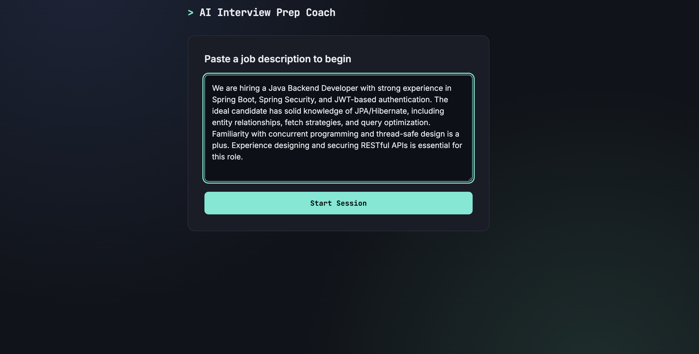
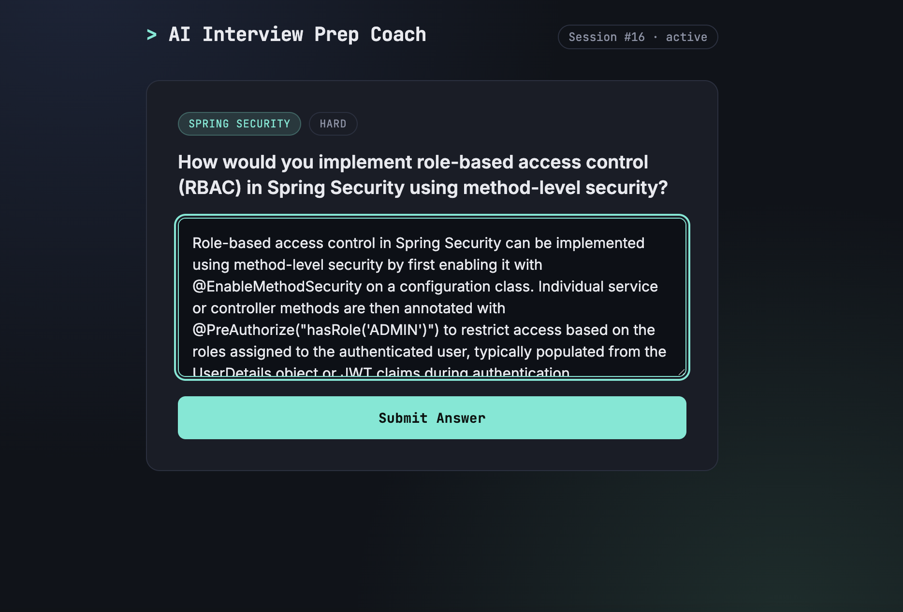
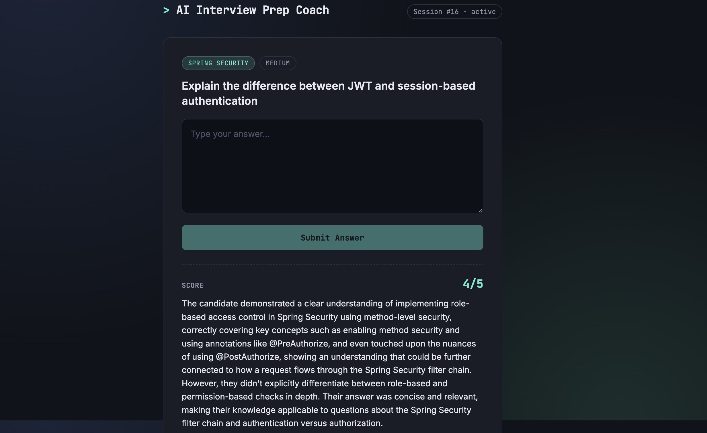
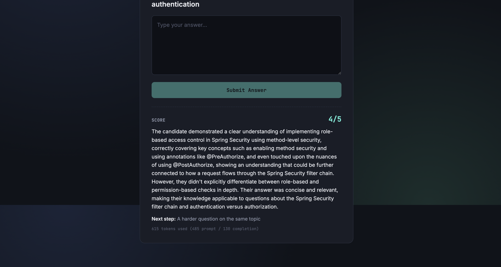
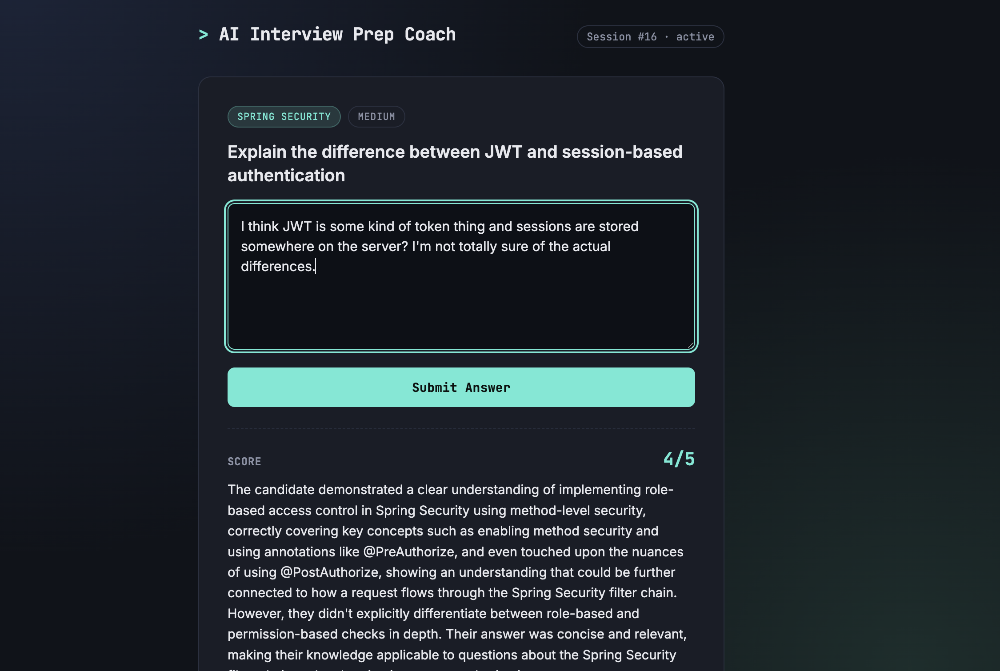
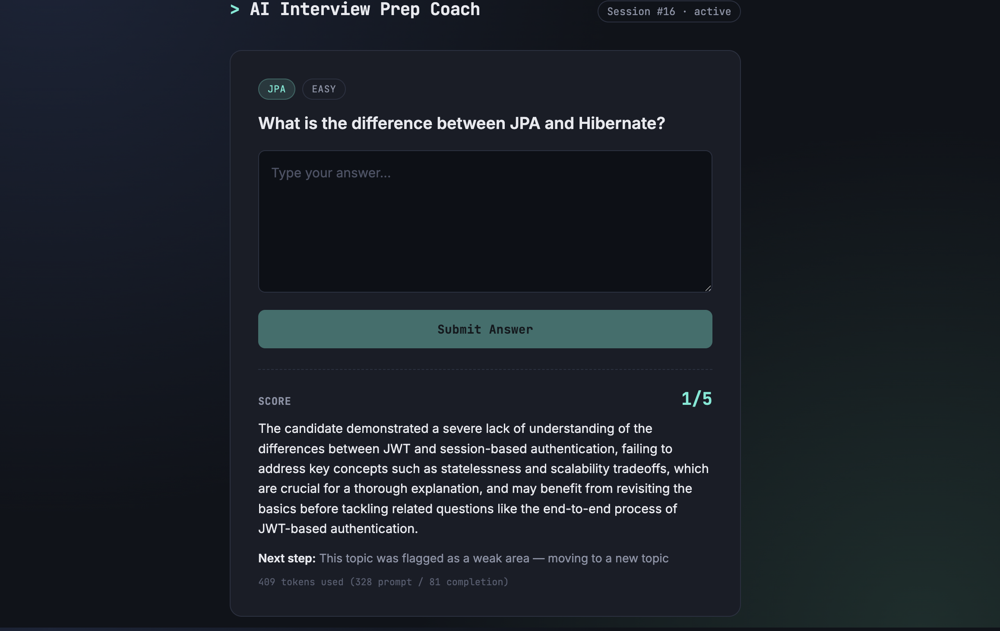
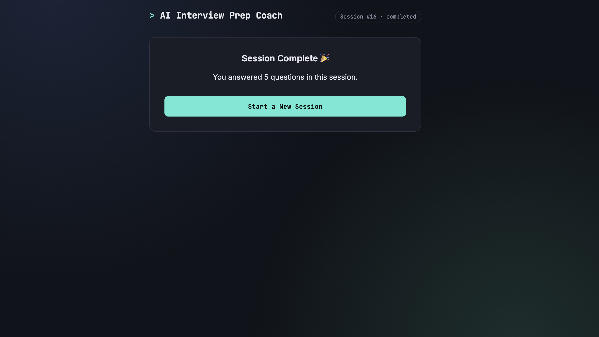

# AI Interview Prep Coach

An AI-powered interview preparation tool that matches job descriptions to relevant interview questions using semantic search, then adaptively quizzes the candidate, evaluating each answer, scoring it, and deciding what to ask next based on performance.

Paste in a job description, and the app retrieves the most relevant questions from a stored question bank using vector similarity search, not keyword matching. After each answer, an LLM evaluates the response, assigns a score, and decides whether to go deeper on the same topic, move to a new one, or flag it as a weak area to revisit.

## Features

- **Semantic question matching** — job descriptions and questions are embedded via Cohere and compared using PostgreSQL's pgvector extension, so matching is based on meaning, not keyword overlap
- **Adaptive quiz flow** — after each answer, the system automatically selects the next question based on the AI's decision: a harder question on the same topic, a new topic, or flagging a weak area
- **RAG-based feedback** — when evaluating an answer, the system retrieves conceptually related questions from the bank and feeds them to the LLM as context, so feedback can reference connected topics
- **Structured evaluation** — every answer gets a 1–5 score, a written evaluation, and an explicit next-step decision, via a deliberately engineered prompt format
- **Weak area tracking** — topics the candidate consistently struggles with are tracked across sessions
- **Cost tracking** — token usage (prompt / completion / total) is recorded per answer
- **Caching** — embeddings are cached in-memory to avoid redundant API calls for repeated text

## Tech stack

- Java 21, Spring Boot 4
- PostgreSQL + pgvector
- Cohere (embeddings)
- Groq / Llama 3.3 (evaluation and decision-making)
- React (frontend — separate repo)

## Screenshots

**Pasting a job description to start a session**


**The best-matched question, selected automatically via vector similarity**


**A strong answer submitted, awaiting evaluation**


**Score, evaluation, and the AI's next-step decision**


**A deliberately weak answer**


**Correctly flagged as a weak area, with the system moving to a new topic**


**Session complete after 5 adaptive questions**


## Running it locally

**Backend**
```bash
# requires PostgreSQL with the pgvector extension enabled
export COHERE_API_KEY=your_key
export GROQ_API_KEY=your_key
./mvnw spring-boot:run
```

**Frontend**
```bash
cd interview-coach-frontend
npm install
npm run dev
```

The backend runs on `localhost:8080`, the frontend on `localhost:5173`.
